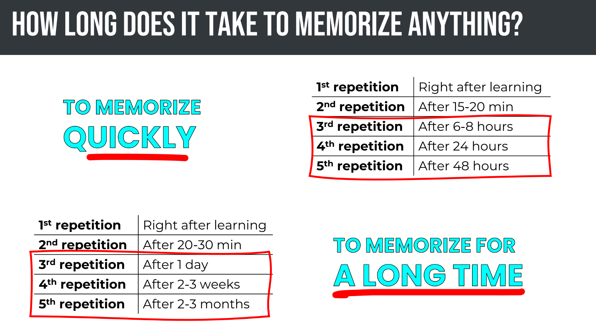
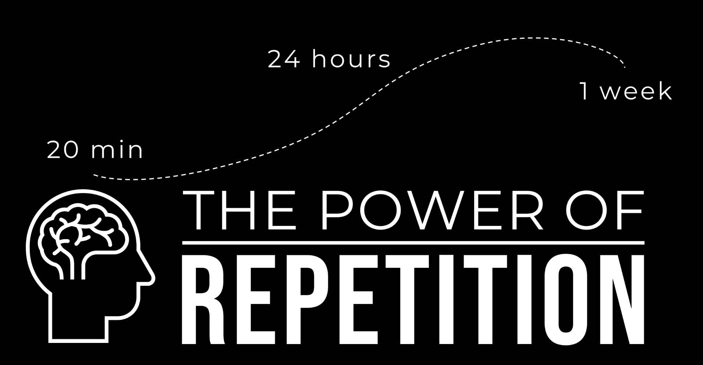
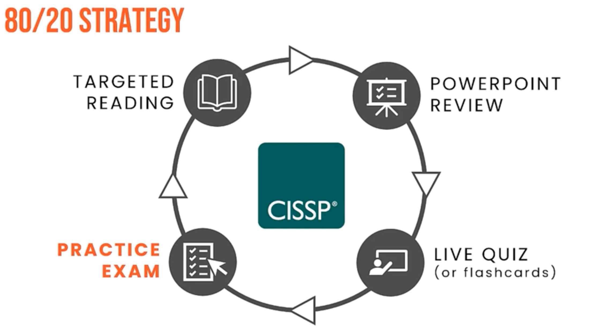
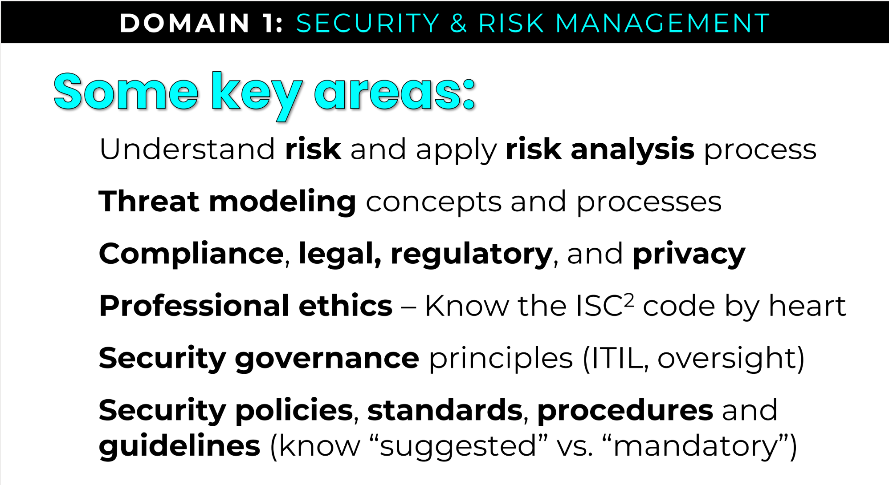
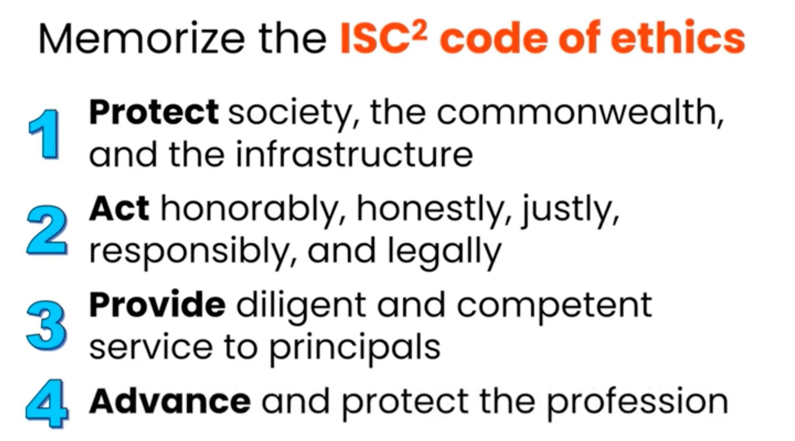

# CISSP Prep

# Study Tips
- Understand BEFORE you memorize
- Use Chunking & Mnemonic Devices & repetition
- Quiz (per domain) > Targeted Reading (of weak areas) > Review PPT > Flashcards
    - Memory Hacks
    

        
    

    

        
    

    

        
    

# Incident Management Framework
- Detection
- Response
- Mitigation
- Reporting
- Recovery
- Lessons Learned

# OSI Model
- 7 Application
- 6 Presentation
- 5 Session
- 4 Transport
- 3 Network
- 2 Data Link
- 1 Physical

    

    

    

