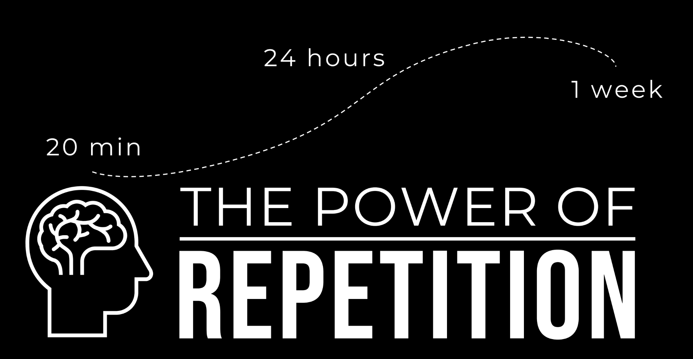

# CISSP Prep

# Study Tips
    Understand BEFORE you memorize
    Use Chunking & Mnemonic Devices & repetition
    Quiz (per domain) > Targeted Reading (of weak areas) > Review PPT > Flashcards
        Memory Hacks

# Incident Management Framework
    Detection
    Response
    Mitigation
    Reporting
    Recovery
    Lessons Learned

# OSI Model
    7 Applicaiton
    6 Presentation
    5 Session
    4 Transport
    3 Network
    2 Data Link
    1 Physical

<!--  -->

