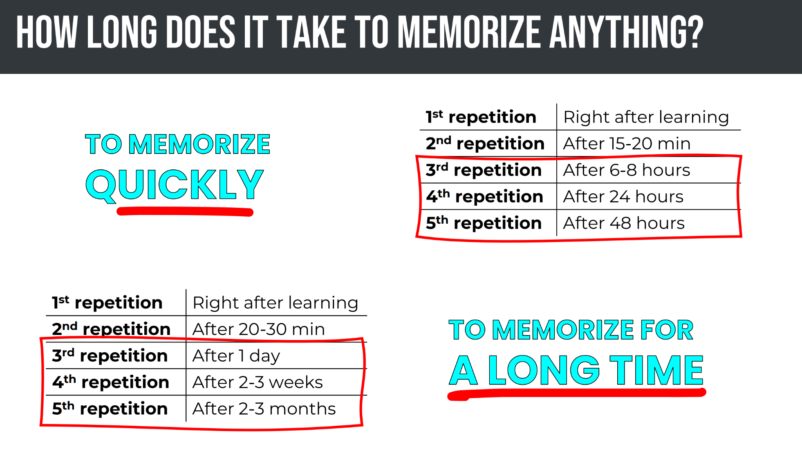
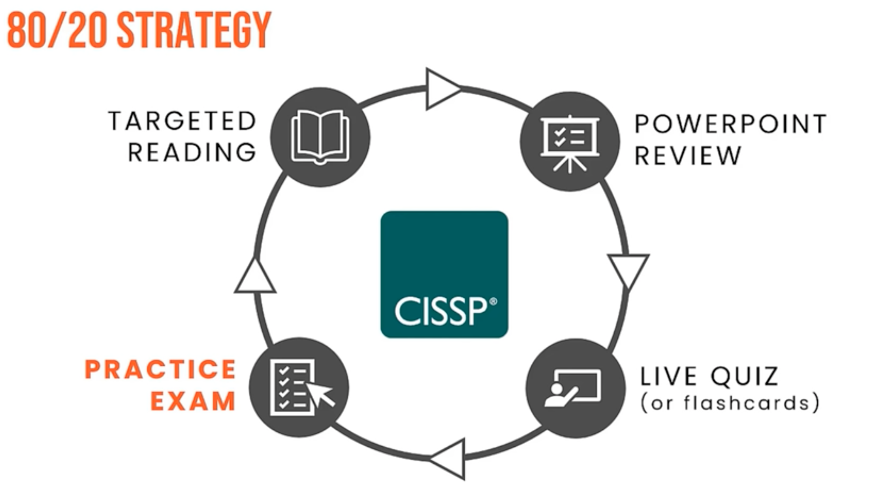

# CISSP Prep

# Study Tips
    Understand BEFORE you memorize
    Use Chunking & Mnemonic Devices & repetition
    Quiz (per domain) > Targeted Reading (of weak areas) > Review PPT > Flashcards
        Memory Hacks

# Pre-prep	

How I passed the CISSp… (Inside Cloud & Security) - 2023-11-04 Completed
https://www.youtube.com/watch?v=8TdL16yYNd0

Recommended Materials
	Official study guide
	Practice questions
	Flashcards
	Video
	Ask partner to quiz you with ppt - short 15 minute burst and go through each part 3-4 days (alt flashcards)\
	pick a topic or two topics, drill down for 15-20 minutes

Initial Prep
	Prep-Prep
	Quiz ~1.5hr
	Material/PPT ~5hr (don’t start from scratch, but add your own flavor to it, focus on 1-2 topics for 15-20 min, repeat 3-4 times)
	Flashcards or Live Quiz
	Final Assessment (look for at least 80% pass)

Circle Back (Supplemental Cycle) 2-4 hours
	Targeted Reading
	PPT - touch up notes
	Live Quiz/Flashcard (15-20min, but only 1-2 cycles)
	Practice Exam
	Rinse and repeated until ready?

About the Exam

	3 hours, 100-150 questions
	Adapts based on answer (increasing difficulty) - all answers are final
	70% to pass, but only pass/fail is recorded
	Must pass each domain - fail one, whole exam is failed

Initial Quiz: 2023-11-04 44%
https://insidethemicrosoftcloud.com/cissp-practice-quiz/ 

### CISSP Exam Cram: The 7 Most Challenging Exam Topics (CISSP 2021)

https://www.youtube.com/watch?v=7FQp3jekUlM

(There are drill down videos for each of these)
	
	Formulas 	
			- know how to use them (practical applications)

	Cryptography 	
			- algorithms, types & how they are used 

			- types more important than keys lengths
			
	Laws & Regulations (high level knowledge)

			- mostly US laws, expect GDPR

	Models & Processes
			- high level process steps
		
			- purpose and use

			- mnemonic devices recommended 
	

### Think Like a Manager
https://www.youtube.com/watch?v=vfC9OLsCqgk

### Memorization Tips & Tricks
https://www.youtube.com/watch?v=vfC9OLsCqgk

OR
CISSP Memorization Tips and Techniques (ultimate guide)
https://www.youtube.com/watch?v=LGqZbiitiDw

# Mindset: Think Like a Manager

# Incident Management Framework
    Detection
    Response
    Mitigation
    Reporting
    Recovery
    Lessons Learned

# OSI Model
    7 Applicaiton
    6 Presentation
    5 Session
    4 Transport
    3 Network
    2 Data Link
    1 Physical

<!--  -->

